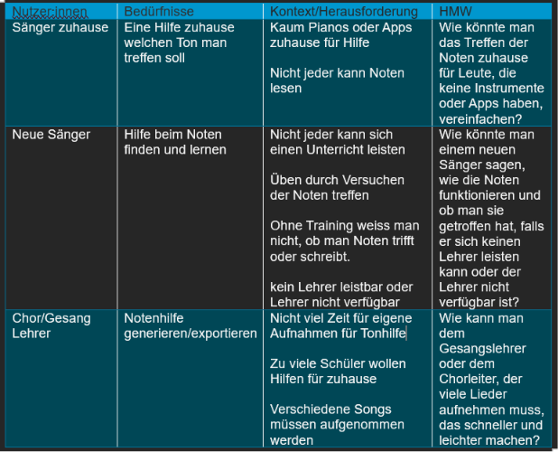
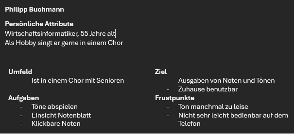
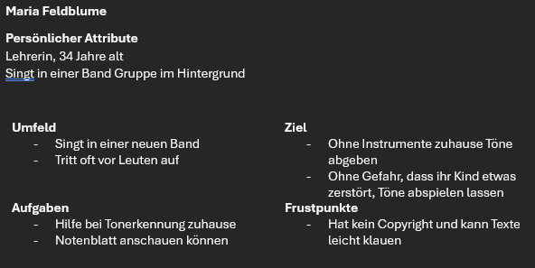
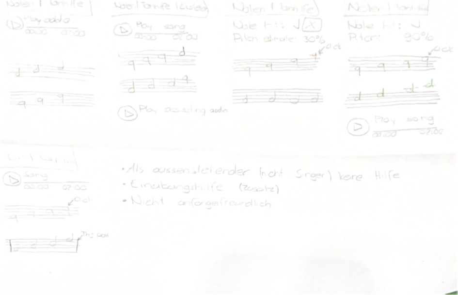
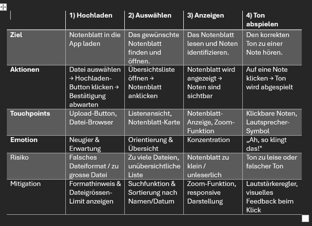
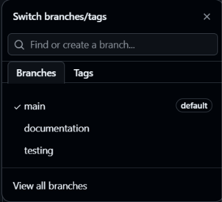
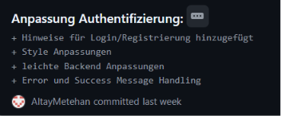

# Projektdokumentation - Tonhelfer

## Inhaltsverzeichnis

1. [Ausgangslage](#1-ausgangslage)
2. [Lösungsidee](#2-lösungsidee)
3. [Vorgehen & Artefakte](#3-vorgehen--artefakte)
    1. [Understand & Define](#31-understand--define)
    2. [Sketch](#32-sketch)
    3. [Decide](#33-decide)
    4. [Prototype](#34-prototype)
    5. [Validate](#35-validate)
4. [Erweiterungen [Optional]](#4-erweiterungen-optional)
5. [Projektorganisation [Optional]](#5-projektorganisation-optional)
6. [KI-Deklaration](#6-ki-deklaration)
7. [Anhang [Optional]](#7-anhang-optional)

<!-- WICHTIG: DIE KAPITELSTRUKTUR DARF NICHT VERÄNDERT WERDEN! -->

<!-- Diese Vorlage ist für eine README.md im Repository gedacht. Abschnitte mit [Optional] können weggelassen werden, wenn in den Übungen nichts anderes verlangt wird. -->

## 1. Ausgangslage
Hier wird Kurz beschrieben, welches Problem adressiert wird und welches Ergebnis angestrebt ist. Wem nützt die Lösung, wer ist beteiligt oder betroffen?
- **Problem:** Wer ein Notenblatt vor sich hat, aber nicht weiss, wie die notierten Töne klingen sollen, steht vor einer grossen Hürde – besonders beim eigenständigen Üben zu Hause. Ohne einen Chorleiter oder ein Instrument ist es für viele Menschen schlicht nicht möglich, sich den richtigen Ton vorzustellen. Ein typisches Beispiel: Jemand möchte ein neues Chorstück zu Hause einüben, sieht die Noten auf dem Papier, weiss aber nicht, ob der Ton hoch oder tief ist. Genau hier setzt dieses Projekt an: Es gibt den gesuchten Ton direkt aus, sodass jede Person selbstständig und ohne fremde Hilfe üben kann.
- **Ziele:** Die Applikation gibt auf Anfrage den korrekten Ton einer ausgewählten Note akustisch aus, sodass Nutzende wissen, wie dieser klingen soll. Singende Personen können dadurch ohne Chorleiter oder Instrument eigenständig und ortsunabhängig üben. Die Anwendung ist einfach und intuitiv bedienbar, damit auch Personen ohne musiktheoretische Vorkenntnisse damit umgehen können. Sie steht einer breiten Nutzergruppe zur Verfügung – von Choreinsteigern bis hin zu fortgeschrittenen Laien – und hilft, Intonationsfehler beim Üben zu reduzieren.
- **Primäre Zielgruppe:** **Chormitglieder ohne Notenkenntnisse**, die neue Stücke zu Hause vorbereiten möchten, aber keinen Chorleiter zur Hand haben. **Gesangsanfänger**, die zum Üben auf ein Instrument oder eine Begleitperson angewiesen wären, dies aber nicht immer organisieren können.
- **Weitere Stakeholder:** **Hobbysingende**, die eigenständig und ortsunabhängig üben möchten, profitieren direkt von der Lösung. **Kinder und Jugendliche** können Noten spielerisch erlernen. **Chorleiter und Dirigenten** können das Tool ihren Mitgliedern als Übungshilfe empfehlen und so die Probenqualität steigern. **Musikschulen und Chörvereine** können die Applikation institutionell einsetzen oder weiterempfehlen. 

## 2. Lösungsidee
Die Applikation ermöglicht es Nutzenden, Notenblätter hochzuladen, in einer Liste auszuwählen und anzuzeigen. Zu jeder Note kann der entsprechende Ton abgespielt werden, damit Nutzende selbstständig und ohne externe Hilfe üben können. Optional lässt sich das Lied über YouTube abspielen, falls die Melodie unbekannt ist.
- **Kernfunktionalität:** (1) Notenblatt hochladen → (2) aus Liste auswählen → (3) Notenblatt anzeigen → (4) Ton abspielen → (5) optional: Lied auf YouTube anhören 
- **Annahmen:** Es wird angenommen, dass das blosse Hören eines Tons ausreicht, damit Nutzende die Note korrekt singen können. Zudem wird vorausgesetzt, dass ein YouTube-Zugang vorhanden ist. Geprüft wird: Verbessert das Abspielen von Tönen die Intonationsfähigkeit der Nutzenden messbar?
- **Abgrenzung:** Eine automatische Überprüfung der Gesangsleistung gehört explizit nicht zum Umfang des Projekts. Der Fokus liegt auf spielerischem Lernen – Nutzende sollen durch Ausprobieren lernen, nicht durch Bewertungen.

## 3. Vorgehen & Artefakte
Die Durchführung erfolgt phasenbasiert; dokumentieren Sie die wichtigsten Ergebnisse je Phase.

### 3.1 Understand & Define
- **Zielgruppenverständnis:**
  - Problemraumanalyse:  
  - Recherche: 
    - Wie funktioniert es?: Es gibt schon einige Apps und KI-Unterstützung oder man kann das Piano selbst abspielen lassen.
    - Was gibt es schon? Existierende Lösungsansätze?: Man kann seine eigenen Tonaufnahmen machen und Apps benutzen, die man auf Google sofort findet, und KI-Hilfe gibt es auch noch.
    - Was kann verbessert werden?: Die Noten geben auf Druck einen Ton ab und man könnte die Musik über YouTube abspielen lassen.
  - Proto-Persona:    
  - User Stories: 
    - Als Sänger möchte ich ein Notenblatt hochladen und Ton abspielen, damit ich zuhause auch ohne Instrumente Tonhilfe bekomme.
    - Als Chormitglied will ich einen Teil meines Notenblattes abspielen, damit ich die Notenblätter zuhause trainieren kann
    - Als Chorleiter möchte ich meine Chormitglieder auf diese Webseite weisen, damit ich entlastet werde Aufnahmen für Tonhilfe zu machen.
- **Wesentliche Erkenntnisse:**
  - Viele Hobbysingende und Chormitglieder haben zuhause keinen Zugang zu einem Instrument oder Chorleiter, um Töne beim Üben zu überprüfen
  - Bestehende Lösungen (Piano-Apps, eigene Tonaufnahmen, KI-Tools) decken den Bedarf nur unvollständig ab – eine direkt anklickbare Notenhilfe fehlt am Markt
  - Nutzende ohne musiktheoretische Vorkenntnisse benötigen eine einfache, intuitive Bedienung, die auch auf dem Smartphone funktioniert
  - Chorleiter und Gesangslehrer sind durch individuelle Tonaufnahmen für Schüler stark belastet – eine App könnte diese Aufgabe übernehmen
  - Die YouTube-Integration wird als wertvolle Ergänzung wahrgenommen, um die gesamte Melodie eines unbekannten Stücks anhören zu können
  - Datenschutz und Copyright sind relevante Bedenken, insbesondere beim Hochladen und Anzeigen von Notenblättern

### 3.2 Sketch
- **Variantenüberblick:** Die Skizzen Varianten zeigen mögliche Prototypen für dieses Projekt, aber die Basis mit den Noten zeigen und abspielen steht immer gleich. Der Rest ist eine weitere Idee, die nicht sein muss.
- **Skizzen:**    Der Unterschied zwischen den Skizzen liegt bei den Funktionen und Ideen. Jede Skizze hat eine neue Idee, wie Stimmen hören oder Musik abspielen oder per Klick oder per Abschnitt abspielen.

### 3.3 Decide
- **Gewählte Variante & Begründung:** Die gewählte Variante wurde hier nur zum Teil skizziert. Als Zusatz kann man die Musik abspielen und man kann per Klick den Ton abspielen. Das Produkt soll simpel gehalten werden und die Stimmen sollten nicht aufgenommen werden für Datenschutz Gründe. Abschnitte abspielen kann man nicht so gut lernen also macht man das am besten nur mit Klick auf die Note. Als Zusatz kann man auch von YouTube die Musik abspielen.
- **End-to-End-Ablauf:** Ein Benutzer soll ein Notenblatt hochladen. Dieser wird in einer Liste angezeigt. Man kann dort auf ein beliebiges Notenblatt klicken. Notenblatt wird angezeigt. Wenn man auf die Note klickt, kommt der entsprechende Ton raus.  
- **Mockup:** 
  - Hier ist der Link zu Figma: https://www.figma.com/design/DZv40EIkbvJTUJ0ZfOhqbU/Tonhelfer-Mockup?node-id=0-1&t=HDbbFUvl4SaZReiU-1  
  - Screenshots:    Hier sind alle Mockups vom Projekt. Das Design ist sehr simpel gehalten. Registrieren gibt man alles nötige ein und dann auch für die Anmeldung, aber diese sind nicht nötig. Man kann auch direkt in die Liste und hochladen oder selbst eine Liste sehen. Man lädt Dateien hoch und sieht dann diese, wenn man es genauer anschauen will. 

### 3.4 Prototype

#### 3.4.1. Entwurf (Design)
Beschreibt die Gestaltung und Interaktion.
> **Hinweis:** Hier wird der **Prototyp** beschrieben, nicht das **Mockup**.
- **Informationsarchitektur:** Das Projekt geht um den Tonhelfer und die Liste ist die Hauptseite. Durch die Bootstrap Navigation kann man zur Registration gehen und danach sich dort auch anmelden. Durch Knopfdruck kommt man zum Upload oder auch zurück zur Liste. Die Detail Seite zeigt dann das Notenblatt und bietet auch die Tonhilfe und mit Knopfdruck kommt man immer zurück.
- **User Interface Design:** _[wichtige Screens: Screenshots mit kurzen Erläuterungen]_  
- **Designentscheidungen:** Das Design wird sehr simpel gehalten, da ein Notenblatt schon sehr viele Details haben kann und die Seite soll nicht zu sehr designt sein. Ich halte es auch schwarz, weiss ausser den Hintergrund. Alles passt zum Notenblatt Thema und der Hintergrund braucht eine andere helle weissliche (Beige) Farbe, weil es sonst unübersichtlich wird.

#### 3.4.2. Umsetzung (Technik)
Fasst die technische Realisierung zusammen.
- **Technologie-Stack:** Es wird SvelteKit benutzt und alles bleibt im Standard. Es wird goto benutzt, um von Registrierung zu Login zu leiten und von Login zur Liste. Eine Ausnahme wäre es den DNS zu verändern, weil es lokal sonst Probleme macht. Für das Backend wird MongoDB benutzt.
- **Tooling:** In der IDE von Visual Studio Code wird die GitHub Erweiterung benutzt. Für das Backend wird MongoDB benutzt. Die Backend Eintröge werden in ein Cluster gemacht und der Connection String und mit MongoDB Compass wird dieses überprüft. 
- **Struktur & Komponenten:** Es gibt die Seiten Upload, Register, Login, Home also die Liste und die Detailseite. Die Routen sind dementsprechend so kontruiert. Es gibt eine wichtige Komponente, die die Liste darstellen lassen kann. Diese werden auch als Props gespeichert.
- **Daten & Schnittstellen:** Daten werden in MongoDB in einem Cluster gespeichert. Mit der Connection String verbindet man sich. In db.js werden alle Daten erstellt und geholt.
- **Deployment:** https://tonhelfer.netlify.app/ 
- **Besondere Entscheidungen:** Ich habe mich dazu entschieden, dass der YouTube Link optional ist, da es für die Abgabe leichter macht und urheberrechtlich weiss ich nicht, ob man das einfach so abspielen kann. 

### 3.5 Validate
- **URL der getesteten Version**: https://testing-tonhelfer.netlify.app/
- **Ziele der Prüfung:** 
  - Kann man sich registrieren?
  - Kann man sich einloggen?
  - Funktioniert der Upload und sieht man eine Liste?
- **Vorgehen:** Es werden andere Personen auf die Seite zugreifen und den Prozess prüfen. Es muss nicht moderiert werden, aber es ist on-site. 
- **Stichprobe:** Es gab zwei Testpersonen aus der Klasse TZBISa. Sie sind Studenten in derselben Klasse. 
- **Aufgaben/Szenarien:** 
  - Du und dein Freund beim Chor möchtet zuhause für ein Duett Stück trainieren, aber ihr habt keine Tonhilfe oder Instrumente zuhause.  
    1. Ihr möchtet euch zusammen am Mittag treffen und zusammen die Duett Stelle trainieren, aber ihr habt keine Hilfe. Findet ein Tool, was euch dabei helfen könnte, dieses Problem zu umgehen.
    2. Benutze dieses Tool, um das Problem zu umgehen.
  - Ein Sänger aus einer Band konnte wegen einem Familiennotfall nicht zur Probe kommen. Sie wollte noch einen Teil ihres Textes üben.
    1. Deine Band hat schon mit den Instrumenten geübt und deine Band hat vorgeschlagen deine Stelle mit einem Tool zum Töne Finden zu lernen. 
    2. Schau, was die Band empfohlen hat und benutze dieses Tool.
- **Kennzahlen & Beobachtungen:** Der Test ging schief. Man kann Dateien zum hochladen auswählen, aber es taucht ein Fehler auf und man sieht keinen Eintrag in der Liste. Das Registrieren und Anmelden funktioniert aber. Das Ganze geht sehr schnell und ist mit ein paar Klicks erledigt.  
- **Zusammenfassung der Resultate:** Das Endprodukt muss noch verbessert werden. Man kann die Notenblätter nicht hochladen und sieht sie auch nicht in der Liste. Anmeldung und Registrierung funktioniert aber einwandfrei.  
- **Abgeleitete Verbesserungen:** Als nächstes sollte man den Fehler zum Upload fixen, damit man eine Liste sieht und dann einen Notenblatt ansehen kann. Dieser soll dann auch einen Ton ausgeben, wenn man auf die Töen klickt.

## 4. Erweiterungen
Dokumentiert Erweiterungen über den Mindestumfang hinaus.

### 4.1 Resgistrierung/Anmeldung
- **Beschreibung & Nutzen:** Wenn man die Noten gespeichert haben will, kann man sich jetzt registrieren und anmelden 
- **Wo umgesetzt:** 
  - **Frontend:** Resgitrierungs- und Anmeldungsseite
  - **Backend:** User Erstellung im Backend mit Namen, Email und Passwort
  - **Datenbank:** Neue Collection in der MongoDB. Die Liste hat einen Lookup zum Nutzer
- **Referenz:** Keine Referenz im Moment
- **Aus Evaluation abgeleitet?:** Nein

## 5. Projektorganisation
Beispiele:
- **Repository & Struktur:** Hier ist der Link zum Repository: https://github.com/AltayMetehan/Semesterarbeit/tree/main  
Branches:  
  
Struktur des Projekts:  

- **Issue-Management:** Bei Problemen werden Issues aufgezeichnet. Es ist wie ein Plan, wie man vorgeht und was gemacht werden soll.  
- **Commit-Praxis:** Bei den Commits wurde ein kurzer Titel hinzugefügt und was hinzugefügt oder weggenommen wurde. Hier ist ein Beispiel:  

## 6. KI-Deklaration
Die folgende Deklaration ist verpflichtend und beschreibt den Einsatz von KI im Projekt.

### 6.1 KI-Tools
- **Eingesetzte Tools**: 
  - Perplexity Claude 4.6 Thinking 
  - Github Copilot Free
- **Zweck & Umfang**: 
  - Perplexity Claude 4.6 Thinking wurde benutzt, um den Text zu verbessern.
  - Github Copilot Free wurde benutzt für Inline Code Vorschläge. Es wurde nicht alles eins zu eins implementiert, aber es ist inspiriert. Das Design wurde zum Teil von KI übernommen.
  - KI wurde als Inspiration benutzt und auch für das Design und wurde teils auch übernommen.
- **Eigene Leistung (Abgrenzung):** Die Strukturierung des Projektes und die Basis wurde von mir selbst erstellt. KI wurde als Inspiration benutzt durch Inline Vorschläge. Resgistrierung und Anmeldung genau so wie Upload und Notenblätter Liste wurde selbst erstellt.

### 6.2 Prompt-Vorgehen
- Um den Text zu verbessern habe ich den Auftrag aufgeschrieben, was ich bisher reingeschreben habe und wie die Struktur sein soll. Danach hab ich es gebeten formell umzuschreiben, so dass es in eine Projektdokumentation passt.
- Für den Code hatte ich Inline Vorschläge an. Ich habe diese für Inspiration benutzt. In Visual Studio Code Chat habe ich gefragt, wie man eine Box mit Schatten macht und den Rest selbst designt. So wurde die KI für Code benutzt. Für Code wurde mehr gefragt, wie man es umsetzen könnte.  

### 6.3 Reflexion
_[Nutzen, Grenzen, Risiken/Qualitätssicherung, ...]_

## 7. Anhang
Beispiele:
- **Quellen:** 
  - Problem mit Backend Verbindung Lösung: https://www.mongodb.com/community/forums/t/error-querysrv-econnrefused-mongodb/259042/3

